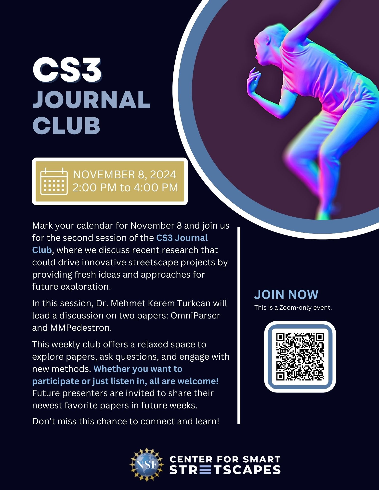

# CS3 Journal Club
{: }

[Join](https://columbiauniversity.zoom.us/j/5643997588?pwd=UHRwS1p6QlZtb0IzUXlvL25KakcvQT09&omn=91079942650){: .btn  .btn-purple .mr-2}
[Papers List](https://center-for-smart-streetscapes-cs3.github.io/cs3journalclub/calendar/){: .btn  .btn-blue}

For any questions, please e-mail CS3 Associate Research Scientist Mehmet Kerem Turkcan at mkt2126@columbia.edu.

Mark your calendar for November 8 and join us online for the second session of the Center for Smart Streetscapes (CS3) Journal Club, where we will discuss recent research that could drive innovative streetscape projects by providing fresh ideas and approaches for future exploration.

In this session, Dr. Mehmet Kerem Turkcan will lead a discussion on two cutting-edge papers: MonST3R and Depth Pro.

This weekly club offers a relaxed space to explore papers, ask questions, and engage with new methods. Whether you want to participate or just listen in, all are welcome! Future presenters are invited to share their newest favorite papers in future weeks.

Don’t miss this chance to connect and learn!

### [**Click Here** to Join](https://columbiauniversity.zoom.us/j/5643997588?pwd=UHRwS1p6QlZtb0IzUXlvL25KakcvQT09&omn=91079942650)
### [**Click Here** for Papers](https://center-for-smart-streetscapes-cs3.github.io/cs3journalclub/calendar/)

For any questions, please e-mail CS3 Associate Research Scientist Mehmet Kerem Turkcan at mkt2126@columbia.edu.

# Background Information

## About the Center for Smart Streetscapes (CS3)

[The Center for Smart Streetscapes (CS3)](https://cs3-erc.org/) is a Gen-4 National Science Foundation (NSF) Engineering Research Center created in 2022 taking a new approach to smart cities and streets by prioritizing community input, organizational partnerships, and education initiatives in the research process. Based in Harlem, New York, the center is a partnership between Columbia University, Lehman College, Florida Atlantic University, University of Central Florida, and Rutgers University.

## Our Mission

The mission of the Center for Smart Streetscapes (CS3), a Gen-4 NSF Engineering Research Center founded in 2022, is to forge livable, safe, and inclusive communities through real-time, hyper-local streetscape applications built on advancements in edge-cloud technology, wireless-optical engineering, visual analytics, computer security, and social science.

We strive to co-develop, with the involvement from the stakeholders at all levels of the design process, a platform of technological solutions that can address current and future community-driven problems, such as vulnerable users' safety, traffic efficiency, public safety, and hyper-local environment sensing.

## Our Values
CS3 convenes researchers, educators, entrepreneurs, and community leaders from different institutions, disciplines, economic sectors, geographies, and experiences, and adheres to three guiding principles in its work:

* Technology must serve the public good;
* Community engagement will serve as a mechanism for direct use-inspiration. All communities must be treated as stakeholders and be empowered to shape technology deployment; and
* The "digital divide" exacerbates inequality and must be addressed by researchers making their work publicly legible and designing curricula and workforce training that responds to current and future talent needs.