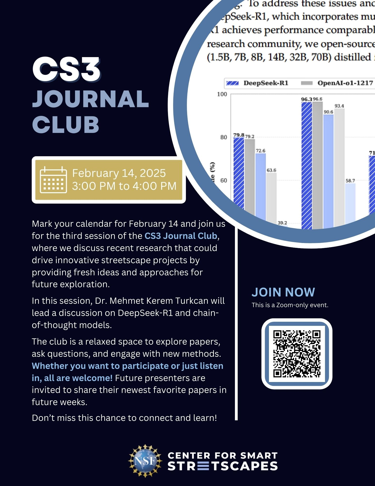

# CS3 Journal Club
{: }

[Register](https://forms.gle/7WL7jdcwanh7zcnX9){: .btn  .btn-purple .mr-2}
[Papers List](https://center-for-smart-streetscapes-cs3.github.io/cs3journalclub/calendar/){: .btn  .btn-blue}

For any questions, please e-mail CS3 Associate Research Scientist Mehmet Kerem Turkcan at mkt2126@columbia.edu.

Mark your calendar for April 18 and join us online for the Center for Smart Streetscapes (CS3) Journal Club, where we will discuss recent research that could drive innovative streetscape projects by providing fresh ideas and approaches for future exploration.

This weekly club offers a relaxed space to explore papers, ask questions, and engage with new methods. Whether you want to participate or just listen in, all are welcome! Future presenters are invited to share their newest favorite papers in future weeks.

Don’t miss this chance to connect and learn!

### [**Click Here** to Register](https://forms.gle/7WL7jdcwanh7zcnX9)
### [**Click Here** for Papers](https://center-for-smart-streetscapes-cs3.github.io/cs3journalclub/calendar/)

For any questions, please e-mail CS3 Associate Research Scientist Mehmet Kerem Turkcan at mkt2126@columbia.edu.

# Background Information

## About the Center for Smart Streetscapes (CS3)

[The Center for Smart Streetscapes (CS3)](https://cs3-erc.org/) is a Gen-4 National Science Foundation (NSF) Engineering Research Center created in 2022  taking a unique approach to streetscape research by uniting community members, researchers, students, government officials, and industry partners. Based in Harlem, New York, the center is a partnership between Columbia University, Lehman College, Florida Atlantic University, University of Central Florida, and Rutgers University.
